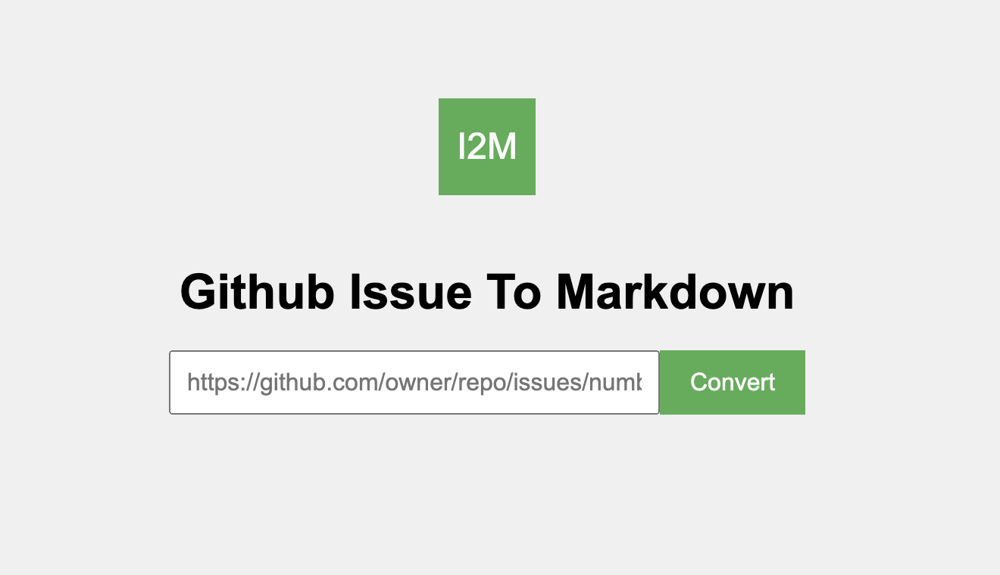

# issue2md

A CLI and web tool to convert GitHub issues, discussions, or pull requests into Markdown format.

[中文文档](./README-zh.md)

>The majority of the content in this repository was generated by AI.

## Command-line Mode

### Install issue2md CLI

```bash
$ go install github.com/abd3lraouf/issue2md/cmd/issue2md@latest
```

### Convert an Issue/Discussion/Pull Request to Markdown

```bash
Usage: issue2md [flags] url [markdown-file]
Arguments:
  url            The URL of the GitHub issue, discussion, or pull request to convert.
  markdown-file  (optional) The output markdown file.
Flags:
  -token string
        GitHub personal access token (overrides GITHUB_TOKEN environment variable)
  -enable-reactions
        Include reactions in the output.
  -enable-user-links
        Enable user profile links in the output.
```

#### Examples

```bash
# Using environment variable
$ export GITHUB_TOKEN=ghp_xxxxxxxxxxxx
$ issue2md https://github.com/owner/repo/issues/123

# Using --token flag
$ issue2md --token ghp_xxxxxxxxxxxx https://github.com/owner/repo/issues/123

# Save to file with reactions
$ issue2md --enable-reactions https://github.com/owner/repo/issues/123 output.md
```

## Web Mode

### Install and Run issue2md Web

#### Run issue2md web with docker(Recommended)

```bash
$ docker run -d -p 8080:8080 abd3lraouf/issue2mdweb
```

#### Compile from source

```bash
$ git clone https://github.com/abd3lraouf/issue2md.git
$ cd issue2md
$ make web
$ ./issue2mdweb
Server is running on http://0.0.0.0:8080
```

### Convert an Item to Markdown

Open `localhost:8080` in your browser:



Input the issue, discussion, or pull request URL you wish to convert and click the "Convert" button!

The web interface includes an optional token field. If you have a `GITHUB_TOKEN` environment variable set when running the server, you can leave this field empty. Provide your own token for:
- Accessing private repositories
- Higher rate limits (5,000 vs 60 requests/hour)
- Organizations requiring SSO authorization

## Authentication

### GitHub Token Sources

issue2md supports multiple ways to provide a GitHub personal access token:

1. **CLI flag**: `--token` (highest priority)
   ```bash
   issue2md --token ghp_xxxxxxxxxxxx https://github.com/owner/repo/issues/123
   ```

2. **Web form field**: Optional token input in the web UI

3. **Environment variable**: `GITHUB_TOKEN` (fallback for both modes)
   ```bash
   export GITHUB_TOKEN=ghp_xxxxxxxxxxxx
   issue2md https://github.com/owner/repo/issues/123
   ```

### When Do You Need a Token?

- **Public repos without token**: 60 API requests per hour
- **With authentication**: 5,000 requests per hour
- **Private repos**: Token is required
- **Organizations with SSO**: Token must be authorized for SSO

### Security Considerations

- Never commit tokens to version control
- Use environment variables for production deployments
- Web UI tokens are never stored or logged
- Tokens should have minimal required scopes:
  - Public repos: `public_repo` scope
  - Private repos: `repo` scope
- Generate tokens at: https://github.com/settings/tokens